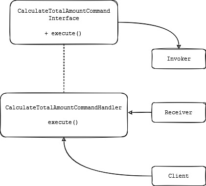

# ACME work hour's prices exercise

## Problem description

The company ACME offers their employees the flexibility to work the hours they want. They will pay for the hours worked based on the day of the week and time of day, according to the following table:

|      Days       |     Hours     |  Price |
|-----------------|---------------|--------|
| Monday - Friday | 00:01 - 09:00 | 25 USD |
| Monday - Friday | 09:01 - 18:00 | 15 USD |
| Monday - Friday | 18:01 - 00:00 | 20 USD |
| Saturday - Sunday  | 00:01 - 09:00 | 30 USD |
| Saturday - Sunday  | 09:01 - 18:00 | 20 USD |
| Saturday - Sunday  | 18:01 - 00:00 | 25 USD |

The goal of this exercise is to calculate the total that the company has to pay an employee, based on the hours they worked and the times during which they worked. 

## How to run

Locaate in the project folder and run in terminal
```bash
$ python3 main.py
```

## Solution explanation
The solution implements *Command* pattern. We have `command.py` file that have our `CalculateTotalAmountCommand` interface and the `CalculateTotalAmountCommandHandler` that is the concrete class that implement our interface. There is also our `Invoker`.

In the `receiver.py` is the `Receiver` class that implements our business logic. The `utils.py` file that have some other functions. And `main.py` our main file to run.

Here is a diagram of the pattern implemented:



To fill the information about hour prices in the week or weekend, two files are needed, the `week.txt` and `weekend.txt` files. Those files have information with the following format:

<<initial_time_range>>,<<final_time_range>>,<<hour_prices>>

For example:

```txt
00:01,09:00,25
09:01,18:00,15
18:01,00:00,20
```

Those files are loaded to get the information. 

Another file are needed to make the calculations, there is the `data.txt` file that has some lines with information about employees, with the following format:

{name}={list_of_hours_separted_by_comma}

For example:
```text
RENE=MO10:00-12:00,TU10:00-12:00,TH01:00-03:00,SA14:00-18:00,SU20:00-21:00
ASTRID=MO10:00-12:00,TH12:00-14:00,SU20:00-21:00
```

The lines are processed by each range, getting the initial time, getting the price and adding one hour to get the next price until the finish hour. The idea behind this is that an employee could start to work in some range with a price and finish in another range.

## Run test

In terminal run
```bash
$ python3 -m unittest *test.py
```